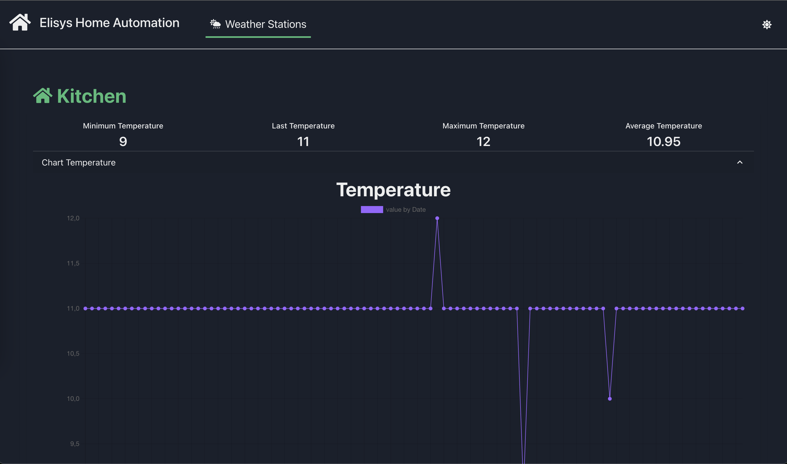
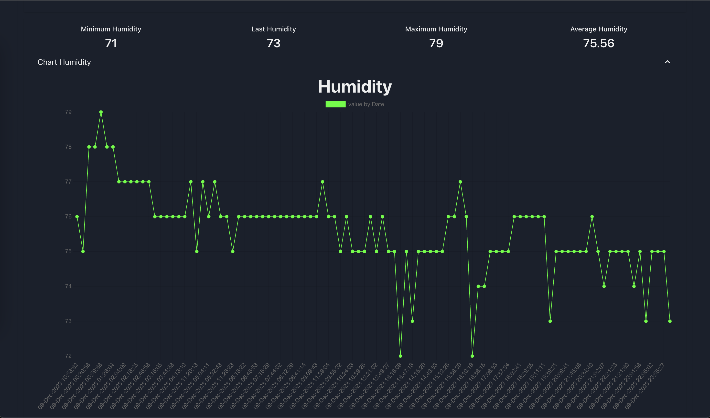
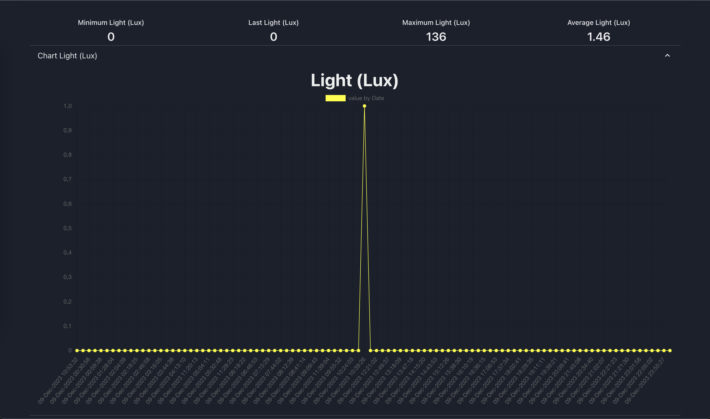

# Elisys Weather Station Client (TypeScript)

Basic implementation of the client side of [Elisys Home Automation project](https://github.com/goto-eof/elisys-home-automation-server-java). Currently it allows to analyze information about Weather sensors. In particular, through Elisys Home Automation Client it is
possible to visualize the minimum temperature/humidity/lux value, maximum temperature/humidity/lux value, average temperature/humidity/lux value and the last temperature/humidity/lux retrieved from sensors. Moreover, E.H.A.C. allows to visualize a chart of the last 24 hours of
the temperature, humidity and lux.

**Elisys Home Automation Client (TypeScript)** is the front-end side
of the following project:
[Elisys Home Automation Server (Java)](https://github.com/goto-eof/elisys-home-automation-server-java), that gathers information from these applications:

- [**Elisys ESP32 Motion Detector (Rust)**](https://github.com/goto-eof/esp32-motion-detector-and-server-notifier-rust)
- [**Elisys ESP32 Weather Station (Rust)**](https://github.com/goto-eof/elisys-esp32-weather-station-client-rust)
- [**Elisys ESP32 Relay Client (Rust)**](https://github.com/goto-eof/elisys-esp32-relay-client-rust)
- [**Elisys ESP32 Alarm Clock (Rust)**](https://github.com/goto-eof/elisys-esp32-alarm-clock-rust)

# How to run the project?

First of all you need to execute:

```
yarn install
```

then create a `.env` file which should contain the url where is installed Elisys Home Automation Server, like:

```
REACT_APP_HOST=http://192.168.1.102:8080/
```

Finally execute:

```
yarn start
```

If the device succeeded in registering to the server, then in the `Weather Stations` menu will appear an item called `Weather Station`.

# Screenshots

| Picture                                |
| -------------------------------------- |
|  |
|     |
|          |
